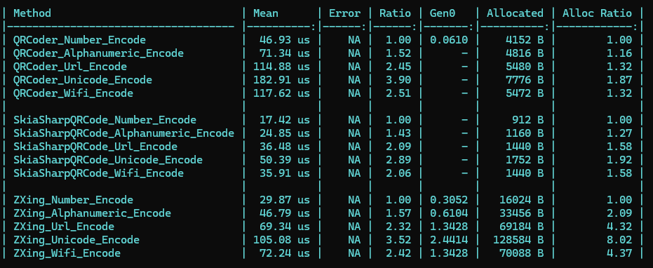
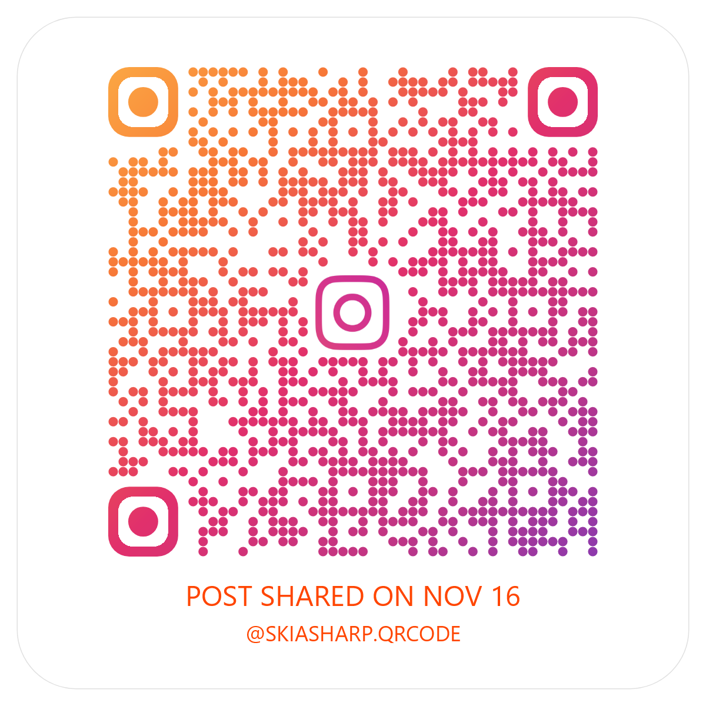
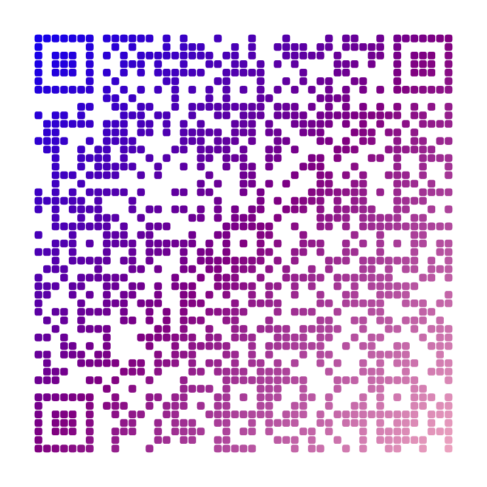
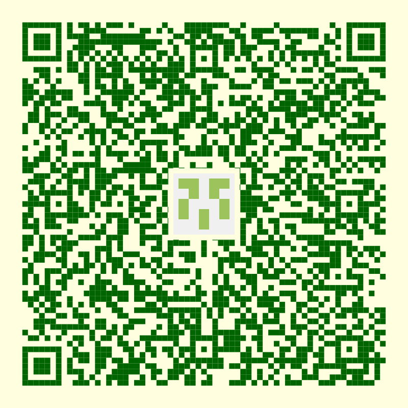

[](https://github.com/guitarrapc/SkiaSharp.QrCode/actions/workflows/build.yaml)
[](https://github.com/guitarrapc/SkiaSharp.QrCode/actions/workflows/release.yaml)

[](LICENSE)
[](https://www.nuget.org/packages/SkiaSharp.QrCode)

# SkiaSharp.QrCode

SkiaSharp.QrCode provides high-performance QR code generation with [SkiaSharp](https://github.com/mono/SkiaSharp) integration.



> Benchmark results comparing SkiaSharp.QrCode with other libraries. See [samples/Benchmark](samples/Benchmark) for details.

Many existing QR code libraries rely on System.Drawing, which has well-known GDI+ limitations and cross-platform issues. SkiaSharp.QrCode was created to provide high performance, minimum memory allocation, a simpler and more intuitive API while leveraging SkiaSharp's cross-platform capabilities. Generate a QR code in a single line, or customize every detail - the choice is yours.

You can create professional-looking QR codes like this with just a few lines of code:

<p float="left">
  
  
  
</p>

See [samples/ConsoleApp](samples/ConsoleApp) for code examples generating these styles.

## Overview

SkiaSharp.QrCode is a modern, high-performance QR code generation library built on SkiaSharp. SkiaSharp.QrCode allocates memory only for the actual QR code data, with zero additional allocations during processing.

- **Simple API**: One-liner QR code generation with sensible defaults
- **High Performance**: Optimal speed and minimum memory allocation
- **Highly Customizable**: Gradients, icons, custom shapes, colors, and more
- **Cross-Platform**: Windows, Linux, macOS, iOS, Android, WebAssembly
- **Zero Dependencies**: QR generation without external libraries (SkiaSharp for rendering only)
- **No System.Drawing**: Avoids GDI+ issues and Windows dependencies
- **NativeAOT Ready**: Full support for .NET Native AOT compilation
- **Modern .NET**: .NET Standard 2.0, 2.1, .NET 8+

## Installation

Visit [SkiaSharp.QrCode on NuGet.org](https://www.nuget.org/packages/SkiaSharp.QrCode)

```bash
dotnet add package SkiaSharp.QrCode
```

## Quick Start

### Simplest Example

Single line QR code generation:

```csharp
using SkiaSharp.QrCode.Image;

// one-liner save to file
QRCodeImageBuilder.SavePng("Hello", "qrcode.png");

// Or get bytes
var pngBytes = QRCodeImageBuilder.GetPngBytes("https://example.com");
```

### Common Use Cases

Generate QR Code for URL

```csharp
var pngBytes = QRCodeImageBuilder.GetPngBytes("https://example.com");
File.WriteAllBytes("qrcode.png", pngBytes);
```

WiFi QR Code

```csharp
var wifiString = "WIFI:T:WPA;S:MyNetwork;P:MyPassword;;";
QRCodeImageBuilder.SavePng(wifiString, "wifi-qr.png");
```

Generate with Custom Settings

```csharp
var qrCode = new QRCodeImageBuilder("https://example.com")
    .WithSize(512, 512)
    .WithErrorCorrection(ECCLevel.H)
    .ToByteArray();
```

Save Directly to Stream

```csharp
using SkiaSharp.QrCode.Image;

using var stream = File.OpenWrite("qrcode.png");
QRCodeImageBuilder.SavePng("Your content here", stream, ECCLevel.M, size: 512);
```

## Migration from 0.8.0 to 0.9.0

v0.9.0 introduces significant performance improvements and API changes. Here's what you need to know to upgrade:

### 🔄 Primary API Change: `QrCode` → `QRCodeImageBuilder`

The `QrCode` class is now **obsolete**. Replace it with `QRCodeImageBuilder`:

**Before (0.8.0):**
```csharp
var qrCode = new QrCode(content, new Vector2Slim(512, 512), SKEncodedImageFormat.Png);
using (var output = new FileStream(path, FileMode.OpenOrCreate))
{
    qrCode.GenerateImage(output);
}
```

**After (0.9.0) - Simple approach:**
```csharp
var pngBytes = QRCodeImageBuilder.GetPngBytes(content);
File.WriteAllBytes(path, pngBytes);
```

**After (0.9.0) - Builder pattern:**
```csharp
using var stream = File.OpenWrite(path);
new QRCodeImageBuilder(content)
    .WithSize(512, 512)
    .WithErrorCorrection(ECCLevel.H)
    .SaveTo(stream);
```

### 🗑️ Remove `using` Statements

`QRCodeData` and `QRCodeRenderer` are no longer `IDisposable`:

**Before (0.8.0):**
```csharp
using var qrCodeData = QRCodeGenerator.CreateQrCode("Hello", ECCLevel.L);
using var renderer = new QRCodeRenderer();
renderer.Render(...);
```

**After (0.9.0):**
```csharp
var qrCodeData = QRCodeGenerator.CreateQrCode("Hello", ECCLevel.L);
QRCodeRenderer.Render(...);  // Now a static method
```

### 📦 Update Namespace for IconData

If using icons in QR codes:

```csharp
// Add this namespace
using SkiaSharp.QrCode.Image;
```

### 🚫 Removed Features

The following features have been removed:
- `forceUtf8` parameter
- ISO-8859-2 encoding support
- Compression feature
- Kanji encoding mode

If you were using these features, you'll need to adjust your code accordingly.

### ✨ New Features to Explore

Take advantage of new capabilities:
- **Gradient colors** - Create eye-catching QR codes with color gradients
- **Enhanced customization** - More control over module shapes and colors
- **Better performance** - Dramatically faster generation with lower memory usage

For complete migration details and examples, see [Release 0.9.0](https://github.com/guitarrapc/SkiaSharp.QrCode/releases/tag/0.9.0).

## API Overview

SkiaSharp.QrCode provides three main APIs for different use cases.

**Recommendation**: Start with `QRCodeImageBuilder` for most scenarios. Use `QRCodeRenderer` when you need canvas control. Use `QRCodeGenerator` only for custom rendering implementations.

| Feature | QRCodeImageBuilder | QRCodeRenderer | QRCodeGenerator |
| --- | --- | --- | --- |
| Ease of use | High | Medium | Low |
| Flexibility | Medium | High | Highest |
| Built-in rendering | Yes | Yes | No |
| Custom canvas control | No | Yes | N/A |
| Recommended for beginners | Yes | No | No |

### QRCodeImageBuilder (Recommended)

Best for Most use cases - simple to advanced QR code generation. The high-level, fluent API for generating QR codes with minimal code. Provides a builder pattern with sensible defaults and extensive customization options.

**Key Features**:
- One-liner generation with `GetPngBytes()`, `SavePng()`
- Fluent API with `WithXxx()` methods
- Built-in support for colors, gradients, icons, shapes
- Multiple output formats (PNG, JPEG, WebP)
- Stream and byte array output

**When to use**:
- Quick QR code generation
- Standard customization needs
- File or stream output

**Example**:
```csharp
var pngBytes = QRCodeImageBuilder.GetPngBytes("content");
```

### QRCodeRenderer (Advanced)

Best for Custom rendering with full control over the canvas. The mid-level API that renders QR data onto an existing SkiaSharp canvas. Useful when you need to integrate QR codes into existing graphics or add custom post-processing.

**Key Features**:
- Render to existing `SKCanvas`
- Full control over rendering area (`SKRect`)
- Combine with other SkiaSharp drawing operations
- Custom effects and post-processing

**When to use**:
- Integrating QR codes into existing graphics
- Adding custom decorations or effects
- Multiple elements on the same canvas

**Example**:
```csharp
var qrData = QRCodeGenerator.CreateQrCode("content", ECCLevel.M);
var canvas = surface.Canvas;
QRCodeRenderer.Render(canvas, area, qrData, SKColors.Black, SKColors.White);
```

### QRCodeGenerator (Low-Level)

Best for QR data generation without rendering. The low-level API that generates raw QR code data (`QRCodeData`). Use this when you need the QR data structure itself, not the image.

**Key Features**:
- Generates `QRCodeData` (boolean module matrix stored as 1D byte array)
- Specify ECC level, ECI mode, quiet zone size
- No rendering logic included
- Smallest API surface

**When to use**:
- Custom rendering implementations
- Non-image output (e.g., ASCII art, LED displays)
- Maximum control over the rendering process

**Example**:
```csharp
var qrData = QRCodeGenerator.CreateQrCode("content", ECCLevel.M, quietZoneSize: 4);
// Use qrData for custom rendering
// Access individual modules: bool isDark = qrData[row, col];
```

## Platform-Specific Considerations

### Linux Support

SkiaSharp requires native dependencies on Linux. You have two options:

#### Option 1: With Font Support (Recommended for text rendering)

Requires `libfontconfig1`:

```bash
sudo apt update && apt install -y libfontconfig1
```

```xml
<PackageReference Include="SkiaSharp.QrCode" Version="0.9.0" />
<PackageReference Include="SkiaSharp.NativeAssets.Linux" Version="3.119.1" />
```

#### Option 2: No Dependencies (QR code only)

If you don't need advanced font operations:

```xml
<PackageReference Include="SkiaSharp.QrCode" Version="0.9.0" />
<PackageReference Include="SkiaSharp.NativeAssets.Linux.NoDependencies" Version="3.119.1" />
```

> **Note**: `NoDependencies` can still draw text but cannot search fonts based on characters or use system fonts.
>
> See: [SkiaSharp Issue #964](https://github.com/mono/SkiaSharp/issues/964#issuecomment-549385484)

### NativeAOT Support

SkiaSharp.QrCode fully supports .NET NativeAOT. You need to include platform-specific native assets:

```xml
<PropertyGroup>
  <PublishAot>true</PublishAot>
  <PublishTrimmed>true</PublishTrimmed>
  <InvariantGlobalization>true</InvariantGlobalization>
</PropertyGroup>
```

> [!WARNING]
>  When using `PublishTrimmed`, ensure that your QR code content and rendering logic doesn't rely on reflection or dynamic code that might be trimmed.

#### Windows

```xml
<PackageReference Include="SkiaSharp.QrCode" Version="0.9.0" />
<PackageReference Include="SkiaSharp.NativeAssets.Win32" Version="3.119.1" />
```

#### Linux

```xml
<PackageReference Include="SkiaSharp.QrCode" Version="0.9.0" />
<PackageReference Include="SkiaSharp.NativeAssets.Linux.NoDependencies" Version="3.119.1" />
```

#### macOS

```xml
<PackageReference Include="SkiaSharp.QrCode" Version="0.9.0" />
<PackageReference Include="SkiaSharp.NativeAssets.macOS" Version="3.119.1" />
```

## Performance

SkiaSharp.QrCode is designed with performance as a top priority. The library minimizes memory allocations and maximizes throughput for QR code generation.

### Key Performance Characteristics

- **Minimal Memory Allocation**: Memory is only allocated for the final QR code data structure. The generation algorithm avoids intermediate allocations, resulting in minimal GC pressure.
- **Zero-Copy Rendering**: Direct rendering to SkiaSharp canvas without unnecessary buffer copies.
- **Optimized Encoding**: Efficient encoding mode selection and bit packing minimize QR code size and generation time.
- **Native Performance**: Leverages SkiaSharp's native rendering engine for maximum speed.

### Benchmark Results

Benchmark results show SkiaSharp.QrCode outperforming other popular .NET QR code libraries in both speed and memory usage.

- **Fastest Generation**: Outperforms other .NET QR code libraries in most scenarios
- **Lowest Memory Usage**: Minimal allocations reduce GC overhead
- **Consistent Performance**: Predictable performance across different QR code sizes and complexity

For detailed benchmark code and results, see the [samples/Benchmark](samples/Benchmark) directory.

## FAQ

### Why choose SkiaSharp.QrCode?

SkiaSharp offers several advantages for QR code generation:

- **Performance**: Native-level performance with hardware acceleration support
- **Cross-Platform**: Runs on Windows, Linux, macOS, iOS, Android, and WebAssembly
- **Modern .NET Support**: First-class support for .NET 6+ and .NET Core
- **No GDI+ Dependencies**: Avoids System.Drawing's Windows-specific issues
- **Rich Graphics API**: Advanced rendering capabilities (gradients, shapes, effects)
- **Active Development**: Well-maintained with regular updates

### Can I use this in ASP.NET Core?

Yes, SkiaSharp.QrCode works great in ASP.NET Core. SkiaSharp.QrCode also supports `IBufferWriter` for efficient memory usage.

```csharp
app.MapGet("/qr", (string url) =>
{
    var pngBytes = QRCodeImageBuilder.GetPngBytes(url);
    return Results.File(pngBytes, "image/png");
});
```

### Does it support Blazor WebAssembly?

Yes, SkiaSharp works in Blazor WebAssembly. See the `samples/BlazorWasm` folder for a complete example.

### What about NativeAOT and trimming?

Yes, fully supported. See the [Platform-Specific Considerations](#platform-specific-considerations) section for details on required native assets.

### ISO-8859-2 and other encodings supports

Currently, SkiaSharp.QrCode supports ISO-8859-1 and UTF-8. Other encodings (e.g., ISO-8859-2, Shift JIS) are not supported at this time. This is mainly due to almost all QR code use cases being UTF-8 compatible nowadays. ISO-8859-2 and other legacy encodings are rarely used in practice.

| Supported | Encoding Mode | Encoding |
| --- | --- | --- |
| Supported | Numeric | ISO-8859-1 |
| Supported | Alphanumeric | ISO-8859-1 |
| Supported | Byte | UTF-8 |
| Not Supported | Kanji | Shift-JIS |

### Any plan to support QR code scanning?

Currently, SkiaSharp.QrCode focuses on QR code generation. QR code scanning is not planned at this time, but contributions are welcome.

### What QR code style provides the best scan reliability?

For optimal scan reliability, we recommend:

- **Use rectangular modules (default)**: Rectangle-shaped modules (`RectangleModuleShape`) provide the lowest error rate when scanning QR codes.
- **Avoid gaps between modules**: Using smaller module sizes or shapes like `Circle` or `RoundRect` creates gaps between modules, which increases scan error rates.
- **Use `ECCLevel.H` for non-standard styles**: If you need to use `Circle`, `RoundRect`, or other custom module shapes, we strongly recommend setting the error correction level to `ECCLevel.H` (High - 30% recovery capacity) to compensate for the reduced readability.
- **Always use `ECCLevel.H` with icons/logos**: When embedding icons or logos using `IconData`, `ECCLevel.H` is required to ensure the QR code remains scannable even when the center is partially obscured.

**Example:**

```csharp
// Best reliability - default settings with rectangular modules
var pngBytes = QRCodeImageBuilder.GetPngBytes("https://example.com");

// If using Circle or RoundRect - use High error correction
var qrCode = new QRCodeImageBuilder("https://example.com")
    .WithSize(800, 800)
    .WithErrorCorrection(ECCLevel.H) // Required for custom shapes
    .WithModuleShape(CircleModuleShape.Default);

// When using icons/logos - always use High error correction
using var logo = SKBitmap.Decode("logo.png");
var icon = new IconData { Icon = logo, IconSizePercent = 15 };

var qrCodeWithIcon = new QRCodeImageBuilder("https://example.com")
    .WithSize(800, 800)
    .WithErrorCorrection(ECCLevel.H) // Required for icons
    .WithIcon(icon);
```

### How can I display QR codes in LINQPad?

Following shows how to display a QRCode inside a LINQPad Results pane.

```csharp
Bitmap.FromStream(new MemoryStream(QRCodeImageBuilder.GetPngBytes("WIFI:T:WPA;S:mynetwork;P:mypass;;"))).Dump();
```

## QR code Specifications

### ECC Level (Error Correction Levels)

QR codes support four levels of error correction, which allow the code to remain readable even when partially damaged or obscured:

| ECC Level | Error Correction Capability | Use Case |
|-----------|----------------------------|----------|
| **L (Low)** | ~7% recovery | Clean environments, maximum data capacity |
| **M (Medium)** | ~15% recovery | General purpose (default recommended) |
| **Q (Quartile)** | ~25% recovery | Outdoor use, moderate damage expected |
| **H (High)** | ~30% recovery | Required when adding logos/icons, harsh environments |

> **Tip**: Use ECC Level H when embedding icons in QR codes to ensure readability even when the center is obscured.

### Encoding Modes

QR codes support different encoding modes optimized for specific character types:

| Mode | Character Set | Bits per Character | Example |
|------|--------------|-------------------|---------|
| **Numeric** | 0-9 | ~3.3 bits | Phone numbers, postal codes |
| **Alphanumeric** | 0-9, A-Z, space, $ % * + - . / : | ~5.5 bits | URLs (uppercase), product codes |
| **Byte** | ISO-8859-1, UTF-8 | 8 bits | Text, URLs (mixed case), binary data |
| **Kanji** | Shift JIS characters | 13 bits | Japanese text |

> **Note**: The library automatically selects the most efficient encoding mode for your content.

### Version and Size

QR codes come in 40 versions (sizes), from Version 1 (21×21 modules) to Version 40 (177×177 modules). Each version adds 4 modules per side.

- **Version 1**: 21×21 modules
- **Version 2**: 25×25 modules
- ...
- **Version 40**: 177×177 modules

The library automatically selects the minimum version that can fit your content based on the selected ECC level.

### Data Capacity Reference

The actual capacity depends on the encoding mode, ECC level, and version. Below are **practical capacities** including overhead (based on test data using 'あ' for UTF-8 multi-byte characters):

#### Quick Reference (Version 10, Common Use Cases)

| ECC Level | Numeric | Alphanumeric | Byte (ASCII) | Byte (UTF-8 Multi-byte*) |
|-----------|---------|--------------|--------------|--------------------------|
| L | 652 | 395 | ~270 | 90 |
| M | 513 | 311 | ~210 | 70 |
| Q | 364 | 221 | ~150 | 50 |
| H | 288 | 174 | ~117 | 39 |

> UTF-8 multi-byte: Japanese hiragana 'あ' (3 bytes/char). For ASCII text (1 byte/char), the capacity is approximately 3× the values shown.

**Full capacity tables** for all versions (1-40) and ECC levels are available in the [Data Capacity Tables](#data-capacity-tables) section below.

### Data Capacity Tables

Full capacity tables for all QR code versions and ECC Levels.

**Test Characters:**
- Numeric: `'1'` (digit)
- Alphanumeric: `'A'` (uppercase letter)
- Byte (ASCII): `'a'` (lowercase, 1 byte)
- Byte (UTF-8): `'あ'` (hiragana, 3 bytes)

**Important Notes:**
- **Numeric**: Pure digit count (0-9)
- **Alphanumeric**: Uppercase letters, digits, and symbols (45 character set)
- **Byte**: UTF-8 encoded Japanese characters (ひらがな 'あ' = 3 bytes per character)
  - For ASCII characters (1 byte each), multiply the byte value by ~3
  - For theoretical byte capacity, refer to ISO/IEC 18004 Table 7

#### ECC Level: L

<details><summary>Click to expand full capacity tables</summary>

| Version | Numeric | Alphanumeric | Byte (UTF-8 Multi-byte*) |
|---------|---------|--------------|------|
|  1 |      41 |           25 |    5 |
|  2 |      77 |           47 |   10 |
|  3 |     127 |           77 |   17 |
|  4 |     187 |          114 |   25 |
|  5 |     255 |          154 |   35 |
|  6 |     322 |          195 |   44 |
|  7 |     370 |          224 |   51 |
|  8 |     461 |          279 |   63 |
|  9 |     552 |          335 |   76 |
| 10 |     652 |          395 |   90 |
| 11 |     772 |          468 |  106 |
| 12 |     883 |          535 |  122 |
| 13 |    1022 |          619 |  141 |
| 14 |    1101 |          667 |  152 |
| 15 |    1250 |          758 |  173 |
| 16 |    1408 |          854 |  195 |
| 17 |    1548 |          938 |  214 |
| 18 |    1725 |         1046 |  239 |
| 19 |    1903 |         1153 |  263 |
| 20 |    2061 |         1249 |  285 |
| 21 |    2232 |         1352 |  309 |
| 22 |    2409 |         1460 |  334 |
| 23 |    2620 |         1588 |  363 |
| 24 |    2812 |         1704 |  390 |
| 25 |    3057 |         1853 |  424 |
| 26 |    3283 |         1990 |  455 |
| 27 |    3517 |         2132 |  488 |
| 28 |    3669 |         2223 |  509 |
| 29 |    3909 |         2369 |  542 |
| 30 |    4158 |         2520 |  577 |
| 31 |    4417 |         2677 |  613 |
| 32 |    4686 |         2840 |  650 |
| 33 |    4965 |         3009 |  689 |
| 34 |    5253 |         3183 |  729 |
| 35 |    5529 |         3351 |  767 |
| 36 |    5836 |         3537 |  810 |
| 37 |    6153 |         3729 |  854 |
| 38 |    6479 |         3927 |  899 |
| 39 |    6743 |         4087 |  936 |
| 40 |    7089 |         4296 |  984 |

</details>

#### ECC Level: M

<details>
<summary>Click to expand full capacity tables</summary>

| Version | Numeric | Alphanumeric | Byte (UTF-8 Multi-byte*) |
|---------|---------|--------------|------|
|  1 |      34 |           20 |    4 |
|  2 |      63 |           38 |    8 |
|  3 |     101 |           61 |   13 |
|  4 |     149 |           90 |   20 |
|  5 |     202 |          122 |   27 |
|  6 |     255 |          154 |   35 |
|  7 |     293 |          178 |   40 |
|  8 |     365 |          221 |   50 |
|  9 |     432 |          262 |   59 |
| 10 |     513 |          311 |   70 |
| 11 |     604 |          366 |   83 |
| 12 |     691 |          419 |   95 |
| 13 |     796 |          483 |  110 |
| 14 |     871 |          528 |  120 |
| 15 |     991 |          600 |  137 |
| 16 |    1082 |          656 |  149 |
| 17 |    1212 |          734 |  167 |
| 18 |    1346 |          816 |  186 |
| 19 |    1500 |          909 |  207 |
| 20 |    1600 |          970 |  221 |
| 21 |    1708 |         1035 |  236 |
| 22 |    1872 |         1134 |  259 |
| 23 |    2059 |         1248 |  285 |
| 24 |    2188 |         1326 |  303 |
| 25 |    2395 |         1451 |  332 |
| 26 |    2544 |         1542 |  352 |
| 27 |    2701 |         1637 |  374 |
| 28 |    2857 |         1732 |  396 |
| 29 |    3035 |         1839 |  421 |
| 30 |    3289 |         1994 |  456 |
| 31 |    3486 |         2113 |  483 |
| 32 |    3693 |         2238 |  512 |
| 33 |    3909 |         2369 |  542 |
| 34 |    4134 |         2506 |  573 |
| 35 |    4343 |         2632 |  602 |
| 36 |    4588 |         2780 |  636 |
| 37 |    4775 |         2894 |  662 |
| 38 |    5039 |         3054 |  699 |
| 39 |    5313 |         3220 |  737 |
| 40 |    5596 |         3391 |  776 |

</details>

#### ECC Level: Q

<details>
<summary>Click to expand full capacity tables</summary>

| Version | Numeric | Alphanumeric | Byte (UTF-8 Multi-byte*) |
|---------|---------|--------------|------|
|  1 |      27 |           16 |    3 |
|  2 |      48 |           29 |    6 |
|  3 |      77 |           47 |   10 |
|  4 |     111 |           67 |   15 |
|  5 |     144 |           87 |   19 |
|  6 |     178 |          108 |   24 |
|  7 |     207 |          125 |   28 |
|  8 |     259 |          157 |   35 |
|  9 |     312 |          189 |   43 |
| 10 |     364 |          221 |   50 |
| 11 |     427 |          259 |   58 |
| 12 |     489 |          296 |   67 |
| 13 |     580 |          352 |   80 |
| 14 |     621 |          376 |   85 |
| 15 |     703 |          426 |   97 |
| 16 |     775 |          470 |  107 |
| 17 |     876 |          531 |  121 |
| 18 |     948 |          574 |  131 |
| 19 |    1063 |          644 |  147 |
| 20 |    1159 |          702 |  160 |
| 21 |    1224 |          742 |  169 |
| 22 |    1358 |          823 |  188 |
| 23 |    1468 |          890 |  203 |
| 24 |    1588 |          963 |  220 |
| 25 |    1718 |         1041 |  238 |
| 26 |    1804 |         1094 |  250 |
| 27 |    1933 |         1172 |  268 |
| 28 |    2085 |         1263 |  289 |
| 29 |    2181 |         1322 |  302 |
| 30 |    2358 |         1429 |  327 |
| 31 |    2473 |         1499 |  343 |
| 32 |    2670 |         1618 |  370 |
| 33 |    2805 |         1700 |  389 |
| 34 |    2949 |         1787 |  409 |
| 35 |    3081 |         1867 |  427 |
| 36 |    3244 |         1966 |  450 |
| 37 |    3417 |         2071 |  474 |
| 38 |    3599 |         2181 |  499 |
| 39 |    3791 |         2298 |  526 |
| 40 |    3993 |         2420 |  554 |

</details>

#### ECC Level: H

<details>
<summary>Click to expand full capacity tables</summary>

| Version | Numeric | Alphanumeric | Byte (UTF-8 Multi-byte*) |
|---------|---------|--------------|------|
|  1 |      17 |           10 |    2 |
|  2 |      34 |           20 |    4 |
|  3 |      58 |           35 |    7 |
|  4 |      82 |           50 |   11 |
|  5 |     106 |           64 |   14 |
|  6 |     139 |           84 |   19 |
|  7 |     154 |           93 |   21 |
|  8 |     202 |          122 |   27 |
|  9 |     235 |          143 |   32 |
| 10 |     288 |          174 |   39 |
| 11 |     331 |          200 |   45 |
| 12 |     374 |          227 |   51 |
| 13 |     427 |          259 |   58 |
| 14 |     468 |          283 |   64 |
| 15 |     530 |          321 |   73 |
| 16 |     602 |          365 |   83 |
| 17 |     674 |          408 |   93 |
| 18 |     746 |          452 |  103 |
| 19 |     813 |          493 |  112 |
| 20 |     919 |          557 |  127 |
| 21 |     969 |          587 |  134 |
| 22 |    1056 |          640 |  146 |
| 23 |    1108 |          672 |  153 |
| 24 |    1228 |          744 |  170 |
| 25 |    1286 |          779 |  178 |
| 26 |    1425 |          864 |  197 |
| 27 |    1501 |          910 |  208 |
| 28 |    1581 |          958 |  219 |
| 29 |    1677 |         1016 |  232 |
| 30 |    1782 |         1080 |  247 |
| 31 |    1897 |         1150 |  263 |
| 32 |    2022 |         1226 |  280 |
| 33 |    2157 |         1307 |  299 |
| 34 |    2301 |         1394 |  319 |
| 35 |    2361 |         1431 |  327 |
| 36 |    2524 |         1530 |  350 |
| 37 |    2625 |         1591 |  364 |
| 38 |    2735 |         1658 |  379 |
| 39 |    2927 |         1774 |  406 |
| 40 |    3057 |         1852 |  424 |

</details>

## Usage Examples

### Basic Usage

#### Using Builder Pattern

```csharp
using SkiaSharp.QrCode.Image;

var qrCode = new QRCodeImageBuilder("https://example.com")
    .WithSize(800, 800)
    .WithErrorCorrection(ECCLevel.H)
    .WithQuietZone(4);

var pngBytes = qrCode.ToByteArray();
File.WriteAllBytes("qrcode.png", pngBytes);
```

#### Direct File Output

```csharp
using SkiaSharp.QrCode.Image;
using var stream = File.OpenWrite("qrcode.png");

new QRCodeImageBuilder("https://example.com")
    .WithSize(1024, 1024)
    .WithErrorCorrection(ECCLevel.H)
    .SaveTo(stream);
```

### Advanced Usage

#### Custom Colors

```csharp
using SkiaSharp;
using SkiaSharp.QrCode.Image;

new QRCodeImageBuilder("https://example.com")
    .WithSize(800, 800)
    .WithColors(
        codeColor: SKColor.Parse("#000080"),      // Navy
        backgroundColor: SKColor.Parse("#FFE4B5"), // Moccasin
        clearColor: SKColors.Transparent)
    .ToByteArray();
```

#### Gradient QR code

```csharp
using SkiaSharp;
using SkiaSharp.QrCode.Image;

var gradient = new GradientOptions(
    [SKColors.Blue, SKColors.Purple, SKColors.Pink],
    GradientDirection.TopLeftToBottomRight,
    [0f, 0.5f, 1f]);

var qrCode = new QRCodeImageBuilder("https://example.com")
    .WithSize(800, 800)
    .WithErrorCorrection(ECCLevel.H)
    .WithGradient(gradient)
    .WithModuleShape(RoundedRectangleModuleShape.Default, sizePercent: 0.9f);

var pngBytes = qrCode.ToByteArray();
```

#### QR code with Logo/Icon

```csharp
using SkiaSharp;
using SkiaSharp.QrCode.Image;

using var logo = SKBitmap.Decode("logo.png");
var icon = new IconData
{
    Icon = logo,
    IconSizePercent = 15,
    IconBorderWidth = 10,
};

var qrCode = new QRCodeImageBuilder("https://example.com")
    .WithSize(800, 800)
    .WithErrorCorrection(ECCLevel.H) // High ECC recommended for icons
    .WithIcon(icon);

var pngBytes = qrCode.ToByteArray();
```

#### Custom Module Shapes

```csharp
using SkiaSharp;
using SkiaSharp.QrCode.Image;

var qrCode = new QRCodeImageBuilder("https://example.com")
    .WithSize(800, 800)
    .WithModuleShape(CircleModuleShape.Default, sizePercent: 0.95f)
    .WithColors(codeColor: SKColors.DarkBlue);

var pngBytes = qrCode.ToByteArray();
```

#### Low-Level Canvas Rendering

For maximum control over rendering:

```csharp
using SkiaSharp;
using SkiaSharp.QrCode;

// Generate QR data
var qrData = QRCodeGenerator.CreateQrCode("https://example.com", ECCLevel.M, quietZoneSize: 4);

// Create canvas
var info = new SKImageInfo(800, 800);
using var surface = SKSurface.Create(info);
var canvas = surface.Canvas;

// Render QR code
canvas.Render(qrData, info.Width, info.Height);

// Save
using var image = surface.Snapshot();
using var data = image.Encode(SKEncodedImageFormat.Png, 100);
using var stream = File.OpenWrite("qrcode.png");
data.SaveTo(stream);
```


## License

MIT

## Acknowledgments

> - [aloisdeniel/Xam.Forms.QRCode](https://github.com/aloisdeniel/Xam.Forms.QRCode) : Qr Sample with Skia
> - [codebude/QRCoder](https://github.com/codebude/QRCoder) : QRCode generation algorithms
