[](https://github.com/guitarrapc/SkiaSharp.QrCode/actions/workflows/build.yaml)
[](https://github.com/guitarrapc/SkiaSharp.QrCode/actions/workflows/release.yaml)

[](LICENSE)
[](https://www.nuget.org/packages/SkiaSharp.QrCode)

# SkiaSharp.QrCode

[Migration](docs/migration.md) | [Data Capacity](docs/data-capacity.md) | [Design Docs](.github/docs)

SkiaSharp.QrCode generates, renders, and decodes QR codes with [SkiaSharp](https://github.com/mono/SkiaSharp).

<div style="display: flex; align-items: flex-start;">
  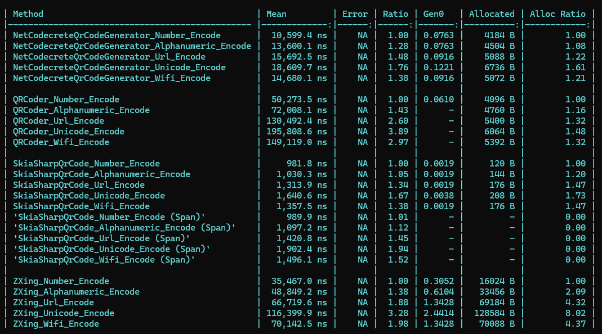
  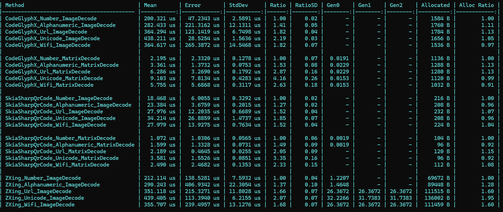
</div>

> Benchmark results comparing SkiaSharp.QrCode with other libraries. See [src/FeatherQR.Benchmark](src/FeatherQR.Benchmark) for details. Above results are generated on .NET 10 with AMD Ryzen 9 7950X3D CPU, with GFNI and AVX2 enabled.

Many existing QR code libraries rely on System.Drawing, which has well-known GDI+ limitations and cross-platform issues. SkiaSharp.QrCode was created to provide high performance, minimum memory allocation, a simpler and more intuitive API while leveraging SkiaSharp's cross-platform capabilities. Generate a QR code in a single line, or customize every detail - the choice is yours.

Create Standard QR, Micro QR, and rMQR images with a few lines of code.

<p float="left">
  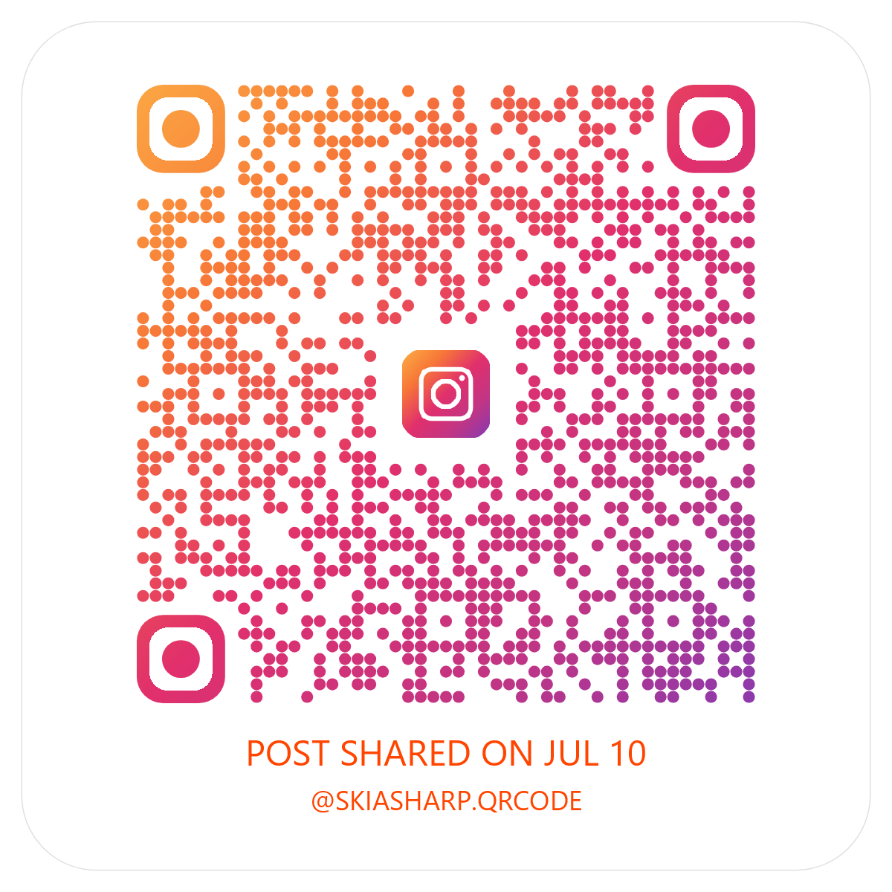
  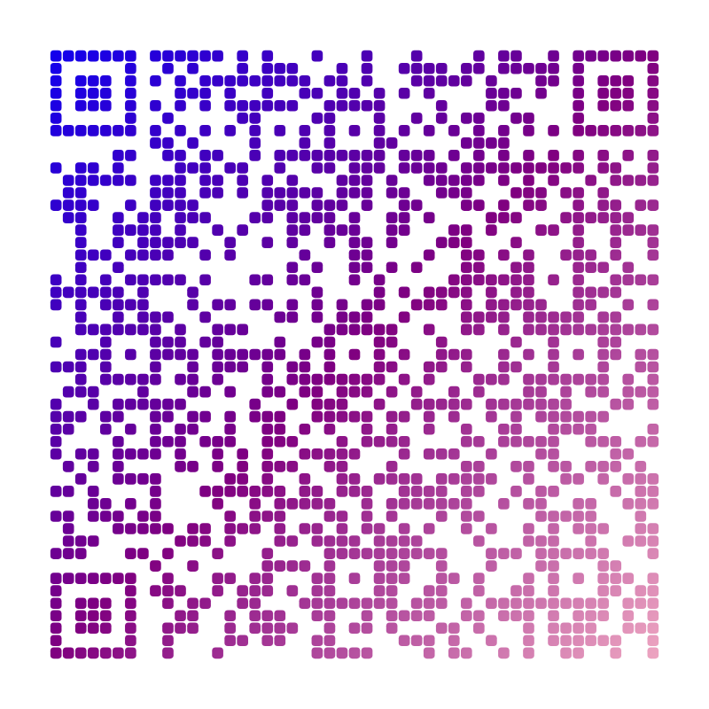
  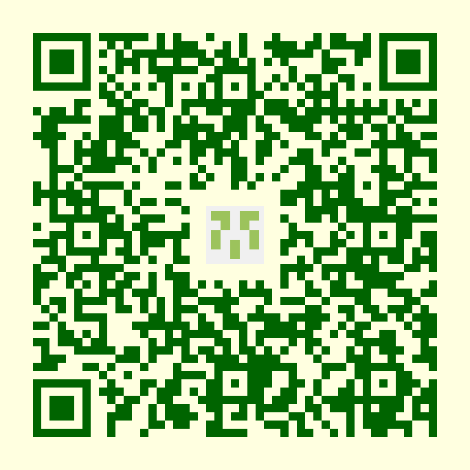
</p>

<p float="left">
  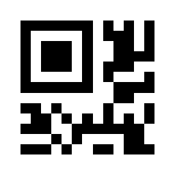
  
</p>

<p float="left">
  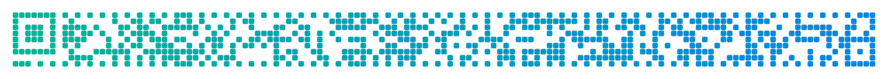
</p>

See [samples/ConsoleApp](samples/ConsoleApp) for code examples generating these styles.

## Playground

Try SkiaSharp.QrCode in your browser, no install required: **[SkiaSharp.QrCode Playground](https://guitarrapc.github.io/SkiaSharp.QrCode/)**

The playground runs the actual library compiled to WebAssembly (GitHub Pages, fully static). Tune gradients, module shapes, finder patterns and logos in realtime, then download the PNG or SVG, or share your settings as a permalink. Every generated code is decoded back in-browser by the library's own decoder as a self-check, and the *Decode an image* panel reads QR codes from your own image files. Source lives in [src/FeatherQR.Playground](src/FeatherQR.Playground); it is deployed to GitHub Pages by [release.yaml](.github/workflows/release.yaml) as part of every release.

## Overview

SkiaSharp.QrCode is a modern, high-performance QR code generation library built on SkiaSharp. SkiaSharp.QrCode allocates memory only for the actual QR code data, with zero additional allocations during processing.

- **Simple API**: One-liner QR code generation with sensible defaults
- **High Performance**: Optimal speed and minimum memory allocation
- **Highly Customizable**: Gradients, icons, custom shapes, colors, and more
- **Raster & Vector Output**: PNG, JPEG, WebP, and SVG (scales without quality loss)
- **Cross-Platform**: Windows, Linux, macOS, iOS, Android, WebAssembly
- **Zero Dependencies**: QR generation without external libraries (SkiaSharp for rendering only)
- **No System.Drawing**: Avoids GDI+ issues and Windows dependencies
- **NativeAOT Ready**: Full support for .NET Native AOT compilation
- **Modern .NET**: .NET Standard 2.0, 2.1, .NET 8+

## Supported Symbologies

SkiaSharp.QrCode supports Standard QR, Micro QR, and rMQR. Examples use Standard QR unless noted otherwise.

| Symbology | Standard | Generate | Decode |
|---|---|---|---|
| Standard QR (versions 1–40) | ISO/IEC 18004 | ✅ | ✅ |
| Micro QR (M1–M4) | ISO/IEC 18004 | ✅ | ✅ |
| rMQR (R7x43–R17x139) | ISO/IEC 23941 | ✅ | ✅ |

<div style="display: flex; align-items: flex-start;">
  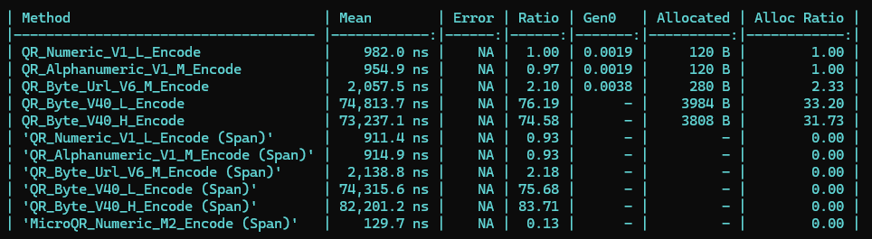
  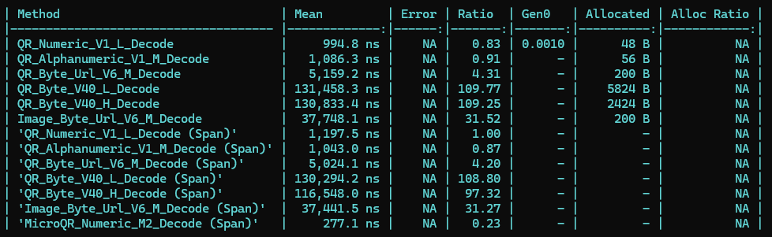
</div>

<div style="display: flex; align-items: flex-start;">
  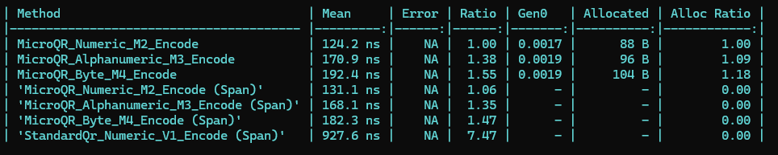
  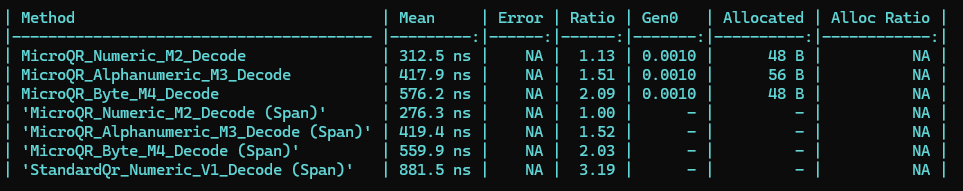
</div>

<div style="display: flex; align-items: flex-start;">
  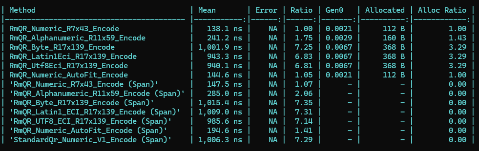
  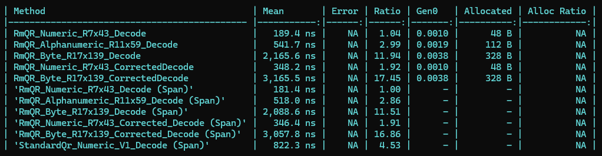
</div>


## Installation

Visit [SkiaSharp.QrCode on NuGet.org](https://www.nuget.org/packages/SkiaSharp.QrCode)

```bash
dotnet add package SkiaSharp.QrCode
```

## Quick Start

### Simplest Example

Single line QR code generation:

```csharp
using SkiaSharp.QrCode.Image;

// one-liner save to file
File.WriteAllBytes("qrcode.png", QRCodeImageBuilder.GetPngBytes("Hello"));

// Or get bytes
var pngBytes = QRCodeImageBuilder.GetPngBytes("https://example.com");
```

### Common Use Cases

Generate QR Code for URL.

```csharp
var pngBytes = QRCodeImageBuilder.GetPngBytes("https://example.com");
File.WriteAllBytes("qrcode.png", pngBytes);
```

WiFi QR Code.

```csharp
var wifiString = "WIFI:T:WPA;S:MyNetwork;P:MyPassword;;";
File.WriteAllBytes("wifi-qr.png", QRCodeImageBuilder.GetPngBytes(wifiString));
```

SVG (vector) output.

```csharp
File.WriteAllText("qrcode.svg", QRCodeImageBuilder.GetSvgString("https://example.com"));
```

Generate with Custom Settings.

```csharp
using SkiaSharp.QrCode;
using SkiaSharp.QrCode.Image;

var qrCode = new QRCodeImageBuilder("https://example.com")
    .WithSize(512, 512)
    .WithErrorCorrection(ECCLevel.H)
    .ToByteArray();
```

Boost Error Correction if possible. The version (symbol size) is chosen for the level you request; when that version has spare capacity, `WithErrorCorrectionBoost` raises the level as far as the capacity allows - without changing the symbol size. Recommended whenever robustness matters more than an exact ECC level, and especially with icons.

```csharp
using SkiaSharp.QrCode;
using SkiaSharp.QrCode.Image;

// Requests M as the minimum; the symbol may come out as Q or H at the same size.
var qrCode = new QRCodeImageBuilder("https://example.com")
    .WithErrorCorrection(ECCLevel.M)
    .WithErrorCorrectionBoost()
    .ToByteArray();

// Generator API equivalent
var qrData = QRCodeGenerator.CreateQrCode("https://example.com", ECCLevel.M, new QRCodeGeneratorOptions { BoostEccLevel = true });
```

Save Directly to Stream

```csharp
using SkiaSharp.QrCode;
using SkiaSharp.QrCode.Image;

using var stream = File.OpenWrite("qrcode.png");
QRCodeImageBuilder.SavePng("Your content here", stream, ECCLevel.M, size: 512);
```

## Migration

See [Migration Guide](docs/migration.md) for details on migrating from older versions of SkiaSharp.QrCode.

## API Overview

Choose an API based on the output you need. Start with an image builder for most applications.

| Task | Standard QR | Micro QR | rMQR |
| --- | --- | --- | --- |
| Create PNG, JPEG, WebP, or SVG | `QRCodeImageBuilder` | `MicroQRCodeImageBuilder` | `RmQRCodeImageBuilder` |
| Generate a module matrix | `QRCodeGenerator` | `MicroQRCodeGenerator` | `RmQRCodeGenerator` |
| Render a matrix to `SKCanvas` | `QRCodeRenderer` | `QRCodeRenderer` | `QRCodeRenderer` |
| Decode a matrix or image | `QRCodeDecoder` | `MicroQRCodeDecoder` | `RmQRCodeDecoder` |

All generators and decoders also provide [zero-allocation APIs](#zero-allocation-apis) for caller-owned buffers.

### Image Builders (Recommended)

Image builders provide one-line methods and a fluent API for colors, gradients, module shapes, image formats, and output size. Standard QR also supports icons and custom finder patterns.

```csharp
var pngBytes = QRCodeImageBuilder.GetPngBytes("content");
```

See the [Standard QR](#standard-qr), [Micro QR](#micro-qr), and [rMQR](#rmqr) examples for each builder.

### QRCodeRenderer (Advanced)

`QRCodeRenderer` renders `QRCodeData`, `MicroQRCodeData`, or `RmQRCodeData` to an existing `SKCanvas`. Use it to place a symbol inside other SkiaSharp graphics.

```csharp
using SkiaSharp;
using SkiaSharp.QrCode;

var qrData = QRCodeGenerator.CreateQrCode("content", ECCLevel.M);
var canvas = surface.Canvas;
QRCodeRenderer.Render(canvas, area, qrData, SKColors.Black, SKColors.White);
```

### Generators (Low-Level)

Generators create module matrices without rendering them. Use them for custom output such as ASCII art or LED displays, or as input to `QRCodeRenderer`.

```csharp
using SkiaSharp.QrCode;

var qrData = QRCodeGenerator.CreateQrCode("content", ECCLevel.M, quietZoneSize: 4);
var isDark = qrData[row, col];
```

For vector output or draw-call based graphics APIs, `GetModuleRectangles` returns the dark modules as merged rectangles in module coordinates (same coordinate space as the indexer, quiet zone included). The rectangles are disjoint and cover exactly the dark modules, and merging typically halves the element count compared to one rectangle per module. Scale by your pixel-per-module factor, or emit them directly into an SVG path with a module-unit `viewBox`:

```csharp
var sb = new StringBuilder();
sb.Append($"<svg xmlns=\"http://www.w3.org/2000/svg\" viewBox=\"0 0 {qrData.Size} {qrData.Size}\" shape-rendering=\"crispEdges\">");
sb.Append("<rect width=\"100%\" height=\"100%\" fill=\"#fff\"/><path fill=\"#000\" d=\"");
foreach (var r in qrData.GetModuleRectangles())
    sb.Append(CultureInfo.InvariantCulture, $"M{r.X},{r.Y}h{r.Width}v{r.Height}h{-r.Width}z");
sb.Append("\"/></svg>");
```

`MicroQRCodeData` and `RmQRCodeData` expose the same members (use `Width`/`Height` instead of `Size` for rMQR). For allocation-free use, size a pooled buffer with `GetModuleRectanglesMaxCount()` and call `TryGetModuleRectangles(Span<ModuleRect>, out int)`.

### Generator options

Beyond the short calls above, every generator entry point has an overload taking an options struct. This is where new options are added, so it is the form to reach for when you need more than the defaults.

```csharp
var qrData = QRCodeGenerator.CreateQrCode("content", ECCLevel.M, new QRCodeGeneratorOptions
{
    EciMode = EciMode.Utf8,
    QuietZoneSize = 0,
});

var rmqr = RmQRCodeGenerator.CreateRmQRCode("content", RmQREccLevel.M, new RmQRCodeGeneratorOptions
{
    Height = RmQRHeight.H9,
    Segmentation = RmQRSegmentation.Optimal,
});
```

`default` is the complete default configuration, so an option you leave out keeps the value the short call would have used.

#### Defaults

| Option | `QRCodeGeneratorOptions` | `MicroQRCodeGeneratorOptions` | `RmQRCodeGeneratorOptions` |
|---|---|---|---|
| `EciMode` | `Default` (auto-detect) | — | `Default` (auto-detect) |
| `Utf8BOM` | `false` | — | — |
| `Version` | `Any` (1-40) | `Any` (M1-M4) | `null` (fit automatically) |
| `QuietZoneSize` | `4` | `2` | `2` |
| `BoostEccLevel` | `false` | — | — |
| `MaskPattern` | `null` (automatic, 0-7) | `null` (automatic, 0-3) | — |
| `FitStrategy` | — | — | `MinimizeArea` |
| `Height` | — | — | `null` (any height) |
| `Segmentation` | `Single` | `Single` | `Single` |

The quiet zone defaults differ because the specifications do: ISO/IEC 18004 requires 4 modules for Standard QR and 2 for Micro QR, ISO/IEC 23941 requires 2 for rMQR. `0` is a valid setting for all three.

`Options.Default` and `default(Options)` are the same value, so these are equivalent:

```csharp
QRCodeGenerator.CreateQrCode("content", ECCLevel.M);                                  // short call
QRCodeGenerator.CreateQrCode("content", ECCLevel.M, QRCodeGeneratorOptions.Default);  // same result
```

#### Changing one option with `with`

The options types are `readonly record struct`, so `with` produces a copy with some members replaced and leaves the original untouched. Useful when a base configuration is shared and one call needs a variation:

```csharp
var house = new QRCodeGeneratorOptions { EciMode = EciMode.Utf8, QuietZoneSize = 7 };

var borderless = house with { QuietZoneSize = 0 };   // EciMode stays Utf8, house is unchanged
var pinned     = house with { Version = 20 };

// starting from the defaults reads the same way
var opts = QRCodeGeneratorOptions.Default with { QuietZoneSize = 0 };
```

Value equality comes with the record, and two option sets that behave identically compare equal: writing a default explicitly is the same value as leaving it out, so `new QRCodeGeneratorOptions { QuietZoneSize = 4 } == QRCodeGeneratorOptions.Default`.

#### Version ranges

Standard QR and Micro QR take a *range* of acceptable versions rather than a single one, which is what you want when the symbol has to reach a minimum physical size, or must not exceed one. A pinned version is the degenerate case of the same setting.

```csharp
new QRCodeGeneratorOptions { Version = 15 }                              // exactly version 15
new QRCodeGeneratorOptions { Version = new(10, 20) }                     // 10 to 20, both inclusive
new QRCodeGeneratorOptions { Version = QRCodeVersionRange.AtLeast(10) }  // 10 or larger
new QRCodeGeneratorOptions { Version = configuredVersion }               // an int?; null means automatic
new QRCodeGeneratorOptions { }                                           // automatic
```

The smallest version in the range that holds the content is used; if none does, `TryGetRequiredBufferSize` returns `false` and the `Create` overloads throw. Bounds are inclusive, and are validated when the range is built, so an impossible range is rejected before a generator sees it.

rMQR has no version range: its 32 versions are not ordered by size (R7x43, R9x43 and R7x59 have no min/max relation), so it constrains fit with `FitStrategy` and `Height` instead.

#### Mask pattern pinning

The generator normally scores the data mask patterns the specification defines (eight for Standard QR, four for Micro QR) and applies the best one. `MaskPattern` pins a specific pattern instead; any pattern yields a valid, decodable symbol, the automatic choice merely optimizes scan reliability. Pinning is the way to reproduce a symbol produced elsewhere byte-for-byte (the pattern another encoder chose is reported by `QRCodeDecodeInfo.MaskPattern` / `MicroQRCodeDecodeInfo.MaskPattern`), or to exercise a scanner against every pattern.

```csharp
// Reproduce a symbol: decode reports the mask, encode accepts it back
QRCodeDecoder.TryDecode(scanned, out var text, out var info);
var identical = QRCodeGenerator.CreateQrCode(text, info.EccLevel, new QRCodeGeneratorOptions { MaskPattern = info.MaskPattern });

// Builder equivalent, Micro QR alike
var png = new QRCodeImageBuilder("content").WithMaskPattern(3).ToByteArray();
var micro = new MicroQRCodeImageBuilder("12345").WithErrorCorrection(MicroQREccLevel.L).WithMaskPattern(1).ToByteArray();
```

`null` (the default) keeps the automatic selection. Values outside the symbology's range (0-7 for Standard QR, 0-3 for Micro QR; the two numberings are unrelated) are rejected when the option is set. rMQR has a single fixed mask (ISO/IEC 23941), so there is nothing to pin.

Because an `int?` converts implicitly, an optional version needs no branch at the call site. That is the job the old `-1` convention did, without the magic number.

#### Mixed-mode segmentation (smaller symbols for mixed content)

By default the whole content is encoded in one mode, so a URL prefix pushes an otherwise numeric payload into Byte mode. `QRCodeSegmentation.Optimal` splits the content into the Numeric / Alphanumeric / Byte runs that cost the fewest bits, which often drops the symbol by a version or more and can even encode content that no single mode fits at any version. It is safe to turn on: the symbol is never larger than the default, and whenever splitting would not shrink it the default bit stream is emitted unchanged.

```csharp
const string content = "https://example.com/item?id=123456789012345678901234567890";

var single = QRCodeGenerator.CreateQrCode(content, ECCLevel.M);
Console.WriteLine(single.Version);  // 4 - one Byte segment

var optimal = QRCodeGenerator.CreateQrCode(content, ECCLevel.M, new QRCodeGeneratorOptions { Segmentation = QRCodeSegmentation.Optimal });
Console.WriteLine(optimal.Version); // 3 - Byte + Numeric

// 5,500 characters overflow Byte mode at every version (40-L holds 2,953), but fit once split
var mixed = new string('x', 1000) + new string('1', 4500);
QRCodeGenerator.CreateQrCode(mixed, ECCLevel.L);                                   // throws: too long
QRCodeGenerator.CreateQrCode(mixed, ECCLevel.L, new QRCodeGeneratorOptions { Segmentation = QRCodeSegmentation.Optimal }); // version 40

// Also available on the image builder
var pngBytes = new QRCodeImageBuilder(content)
    .WithSegmentation(QRCodeSegmentation.Optimal)
    .ToByteArray();
```

It is opt-in so existing callers keep their exact bit streams. Planning allocates nothing for typical content and adds noticeable cost only where a split could actually win a smaller version.

Three notes:

- Size destination buffers with the same `Segmentation` you encode with, `TryGetRequiredBufferSize` honors it, and the two can select different versions.
- A split the decoder would misread is never emitted: with `Utf8BOM` writing a byte order mark the single-mode stream is kept, and content only such a split could fit reports "does not fit" instead of corrupting.
- All three symbologies carry the option (`QRCodeSegmentation`, `MicroQRSegmentation`, `RmQRSegmentation`, see the rMQR section below). On Micro QR the plan respects each version's mode set (M1 is Numeric-only, M2 has no Byte mode), and the tiny capacities make even short mixed content win:

```csharp
var micro = MicroQRCodeGenerator.CreateMicroQRCode("AB12345678901234567", MicroQREccLevel.L,
    new MicroQRCodeGeneratorOptions { Segmentation = MicroQRSegmentation.Optimal }); // M3 instead of M4
```

### Zero-allocation APIs

All three generators can write a module matrix to a caller-provided `Span<byte>`. All three decoders can read a module span and write text to a caller-provided `Span<char>`. Use these overloads when you want to pool or reuse buffers.

Size the generation buffer with `TryGetRequiredBufferSize`:

```csharp
using System.Buffers;
using SkiaSharp.QrCode;

if (!QRCodeGenerator.TryGetRequiredBufferSize("content", ECCLevel.M, out var calculated))
    return "Content does not fit a QR symbol at this ECC level.";

var buffer = ArrayPool<byte>.Shared.Rent(calculated.BufferSize);
try
{
    var written = QRCodeGenerator.CreateQrCode("content", ECCLevel.M, buffer);
    var matrix = buffer.AsSpan(0, written);
}
finally
{
    ArrayPool<byte>.Shared.Return(buffer);
}
```

**Sizing is a `Try` operation on all three symbologies, and only a `Try`.** "The content does not fit" is a data-dependent answer, not a defect: Micro QR M1 holds 5 digits and rMQR holds 5–150 bytes, so overflow is an ordinary outcome for any caller handling input it did not choose. Reporting it as an exception would also cost one to two orders of magnitude more than the encode it is reporting on. The same reasoning is why the modern BCL sizes and formats into caller buffers with `Utf8Formatter.TryFormat` and `Base64.EncodeToUtf8` rather than with throwing twins.

The resolved version composes into the encode, so no length error can follow:

```csharp
if (!RmQRCodeGenerator.TryGetRequiredBufferSize(userInput, RmQREccLevel.M, out var size))
    return "Content does not fit an rMQR symbol.";

var buffer = ArrayPool<byte>.Shared.Rent(size.BufferSize);
try
{
    // Passing the resolved version back removes the fit, so no length error can follow.
    var written = RmQRCodeGenerator.CreateRmQRCode(userInput, RmQREccLevel.M, buffer, new RmQRCodeGeneratorOptions { Version = size.Version });
    var matrix = buffer.AsSpan(0, written);
}
finally
{
    ArrayPool<byte>.Shared.Return(buffer);
}
```

`false` means one thing: the content does not fit. Invalid arguments (an undefined ECC level, a `Version` and `Height` that disagree, a negative quiet zone) still throw, so a caller never renders a configuration mistake as "content too long". This matches how the BCL's configurable `Try` overloads behave (`int.TryParse` with a malformed `NumberStyles`, `Dictionary.TryGetValue` with a null key).

> **`GetRequiredBufferSize` is obsolete.** Standard QR and Micro QR still carry the throwing sizing method released in v1.1.1, marked `[Obsolete]` and scheduled for removal in 2.0.0. rMQR never shipped one. Replace `GetRequiredBufferSize(text, ecc, …)` with `TryGetRequiredBufferSize(text, ecc, out var size, …)`; see [docs/migration.md](docs/migration.md).

### Decoders

Use the decoder that matches the expected symbol type. Each decoder accepts generated data, a byte-per-module matrix, an `SKBitmap`, or a grayscale luminance span.

Image decoding is intended for screenshots, generated images, and clean scans. For camera images with strong perspective, uneven lighting, or blur, use a dedicated scanner such as ZXing.Net.

```csharp
using SkiaSharp;
using SkiaSharp.QrCode;

var qrData = QRCodeGenerator.CreateQrCode("content", ECCLevel.M);
if (QRCodeDecoder.TryDecode(qrData, out var text))
{
    Console.WriteLine(text);
}

using var bitmap = SKBitmap.Decode("qr.png");
if (QRCodeDecoder.TryDecode(bitmap, out var text, out var info))
{
    Console.WriteLine($"{text} (version {info.Version}, ECC {info.EccLevel})");
}
```

The returned decode information includes a status when decoding fails.

## Platform-Specific Considerations

### Linux Support

SkiaSharp requires native dependencies on Linux. You have two options:

#### Option 1: With Font Support (Recommended for text rendering)

Requires `libfontconfig1`:

```bash
sudo apt update && apt install -y libfontconfig1
```

```xml
<PackageReference Include="SkiaSharp.QrCode" Version="2.0.0-preview.1" />
<PackageReference Include="SkiaSharp.NativeAssets.Linux" Version="4.148.0" />
```

#### Option 2: No Dependencies (QR code only)

If you don't need advanced font operations:

```xml
<PackageReference Include="SkiaSharp.QrCode" Version="2.0.0-preview.1" />
<PackageReference Include="SkiaSharp.NativeAssets.Linux.NoDependencies" Version="4.148.0" />
```

> **Note**: `NoDependencies` can still draw text but cannot search fonts based on characters or use system fonts.
>
> See: [SkiaSharp Issue #964](https://github.com/mono/SkiaSharp/issues/964#issuecomment-549385484)

### NativeAOT Support

SkiaSharp.QrCode fully supports .NET NativeAOT. The library is marked `IsAotCompatible`, and CI publishes a NativeAOT gate project that roots the whole library and fails on any trim/AOT analysis warning, so this claim is toolchain-verified on every change. You need to include platform-specific native assets:

```xml
<PropertyGroup>
  <PublishAot>true</PublishAot>
  <PublishTrimmed>true</PublishTrimmed>
  <InvariantGlobalization>true</InvariantGlobalization>
</PropertyGroup>
```

> [!WARNING]
>  When using `PublishTrimmed`, ensure that your QR code content and rendering logic doesn't rely on reflection or dynamic code that might be trimmed.

#### Windows

```xml
<PackageReference Include="SkiaSharp.QrCode" Version="2.0.0-preview.1" />
<PackageReference Include="SkiaSharp.NativeAssets.Win32" Version="4.148.0" />
```

#### Linux

```xml
<PackageReference Include="SkiaSharp.QrCode" Version="2.0.0-preview.1" />
<PackageReference Include="SkiaSharp.NativeAssets.Linux.NoDependencies" Version="4.148.0" />
```

#### macOS

```xml
<PackageReference Include="SkiaSharp.QrCode" Version="2.0.0-preview.1" />
<PackageReference Include="SkiaSharp.NativeAssets.macOS" Version="4.148.0" />
```

## Performance

SkiaSharp.QrCode is designed with performance as a top priority. The library minimizes memory allocations and maximizes throughput for QR code generation.

### Key Performance Characteristics

- **Minimal Memory Allocation**: Memory is only allocated for the final QR code data structure. The generation algorithm avoids intermediate allocations, resulting in minimal GC pressure.
- **Zero-Copy Rendering**: Direct rendering to SkiaSharp canvas without unnecessary buffer copies.
- **Optimized Encoding**: Efficient encoding mode selection and bit packing minimize QR code size and generation time.
- **Native Performance**: Leverages SkiaSharp's native rendering engine for maximum speed.

### Benchmark Results

Benchmark results show SkiaSharp.QrCode outperforming other popular .NET QR code libraries in both speed and memory usage.

- **Fastest Generation**: Outperforms other .NET QR code libraries in most scenarios
- **Lowest Memory Usage**: Minimal allocations reduce GC overhead
- **Consistent Performance**: Predictable performance across different QR code sizes and complexity

For detailed benchmark code and results, see the [src/FeatherQR.Benchmark](src/FeatherQR.Benchmark) directory.

## FAQ

### Why choose SkiaSharp.QrCode?

SkiaSharp offers several advantages for QR code generation:

- **Performance**: Native-level performance with hardware acceleration support
- **Cross-Platform**: Runs on Windows, Linux, macOS, iOS, Android, and WebAssembly
- **Modern .NET Support**: First-class support for .NET 6+ and .NET Core
- **No GDI+ Dependencies**: Avoids System.Drawing's Windows-specific issues
- **Rich Graphics API**: Advanced rendering capabilities (gradients, shapes, effects)
- **Active Development**: Well-maintained with regular updates

### Can I use this in ASP.NET Core?

Yes, SkiaSharp.QrCode works great in ASP.NET Core. SkiaSharp.QrCode also supports `IBufferWriter` for efficient memory usage.

```csharp
app.MapGet("/qr", (string url) =>
{
    var pngBytes = QRCodeImageBuilder.GetPngBytes(url);
    return Results.File(pngBytes, "image/png");
});

app.MapGet("/qr.svg", (string url) =>
{
    var svgBytes = QRCodeImageBuilder.GetSvgBytes(url);
    return Results.File(svgBytes, "image/svg+xml");
});
```

### Does it support Blazor WebAssembly?

Yes, SkiaSharp.QrCode works in Blazor WebAssembly & Pure WebAssembly.

- See the [samples/BlazorWasm](samples/BlazorWasm) folder for a Blazor WebAssembly example.
- See [src/FeatherQR.Playground](src/FeatherQR.Playground) for Pure WebAssembly usage.

### What about NativeAOT and trimming?

Yes, fully supported and verified in CI: the library sets `IsAotCompatible`, and every change publishes a NativeAOT analysis gate ([tests/FeatherQR.AotAnalysis](tests/FeatherQR.AotAnalysis)) that treats trim/AOT warnings as errors. See the [Platform-Specific Considerations](#platform-specific-considerations) section for details on required native assets.

### Are ISO-8859-2 and other encodings supported?

Encoding: SkiaSharp.QrCode writes ISO-8859-1 and UTF-8. Other encodings (e.g. ISO-8859-2, Shift JIS) are not written, mainly because almost all QR code use cases are UTF-8 compatible nowadays and other legacy encodings are rarely used in practice.

Decoding is wider: the decoders also read Kanji mode segments (Shift JIS, JIS X 0208) produced by other encoders. ECI 20 (Shift_JIS) Byte segments are still not read.

| Supported | Encoding Mode | Encoding |
| --- | --- | --- |
| Supported | Numeric | ISO-8859-1 |
| Supported | Alphanumeric | ISO-8859-1 |
| Supported | Byte | UTF-8 |
| Decode only | Kanji | Shift JIS (JIS X 0208) |

### Does SVG output require SkiaSharp.Svg or other packages?

No. SVG output uses `SKSvgCanvas` from the core SkiaSharp package, no additional dependencies. Note that SkiaSharp.QrCode outputs SVG only; it does not read or render existing SVG files.

### Any plan to support QR code scanning?

Yes. `QRCodeDecoder` decodes QR codes from module matrices and from images (see [API Overview](#decoders)). Image decoding intentionally targets clean inputs: screenshots, rendered QR codes, and scans, including rotated and mirrored ones. Robust decoding of real-world photos (perspective distortion, uneven lighting, blur) is a computer-vision problem outside this library's scope, use a dedicated reader such as ZXing.Net for camera captures.

### What QR code style provides the best scan reliability?

For optimal scan reliability, we recommend:

- **Use rectangular modules (default)**: Rectangle-shaped modules (`RectangleModuleShape`) provide the lowest error rate when scanning QR codes.
- **Avoid gaps between modules**: Using smaller module sizes or shapes like `Circle` or `RoundRect` creates gaps between modules, which increases scan error rates.
- **Use `ECCLevel.H` for non-standard styles**: If you need to use `Circle`, `RoundRect`, or other custom module shapes, we strongly recommend setting the error correction level to `ECCLevel.H` (High - 30% recovery capacity) to compensate for the reduced readability.
- **Always use `ECCLevel.H` with icons/logos**: When embedding icons or logos using `IconData`, `ECCLevel.H` is required to ensure the QR code remains scannable even when the center is partially obscured.

**Example:**

```csharp
using SkiaSharp;
using SkiaSharp.QrCode;
using SkiaSharp.QrCode.Image;

// Best reliability - default settings with rectangular modules
var pngBytes = QRCodeImageBuilder.GetPngBytes("https://example.com");

// If using Circle or RoundRect - use High error correction
var qrCode = new QRCodeImageBuilder("https://example.com")
    .WithSize(800, 800)
    .WithErrorCorrection(ECCLevel.H) // Required for custom shapes
    .WithModuleShape(CircleModuleShape.Default);

// When using icons/logos - always use High error correction
using var logo = SKBitmap.Decode(File.ReadAllBytes("logo.png"));
var icon = IconData.FromImage(logo, iconSizePercent: 15);

var qrCodeWithIcon = new QRCodeImageBuilder("https://example.com")
    .WithSize(800, 800)
    .WithErrorCorrection(ECCLevel.H) // Required for icons
    .WithIcon(icon);

// Or let the symbol absorb the icon with whatever capacity it has to spare:
// requests M as the floor and raises the level to fill the chosen version.
var qrCodeBoosted = new QRCodeImageBuilder("https://example.com")
    .WithSize(800, 800)
    .WithErrorCorrection(ECCLevel.M)
    .WithErrorCorrectionBoost()
    .WithIcon(icon);
```

### How can I display QR codes in LINQPad?

Following shows how to display a QRCode inside a LINQPad Results pane.

```csharp
Bitmap.FromStream(new MemoryStream(QRCodeImageBuilder.GetPngBytes("WIFI:T:WPA;S:mynetwork;P:mypass;;"))).Dump();
```

## Standard QR Specifications

### ECC Level (Error Correction Levels)

QR codes support four levels of error correction, which allow the code to remain readable even when partially damaged or obscured:

> [!TIP]
> Use ECC Level H when embedding icons in QR codes to ensure readability even when the center is obscured.

| ECC Level | Error Correction Capability | Use Case |
|-----------|----------------------------|----------|
| **L (Low)** | ~7% recovery | Clean environments, maximum data capacity |
| **M (Medium)** | ~15% recovery | General purpose (default recommended) |
| **Q (Quartile)** | ~25% recovery | Outdoor use, moderate damage expected |
| **H (High)** | ~30% recovery | Required when adding logos/icons, harsh environments |

### Encoding Modes

QR codes support different encoding modes optimized for specific character types. SkiaSharp.QrCode automatically selects the most efficient mode for your content.

> [!NOTE]
> Kanji is decode only. The decoders read Kanji segments produced by other encoders (JIS X 0208), but the generators always write Japanese text in Byte mode as UTF-8.
>
> The mapping is JIS X 0208, not Microsoft CP932. They disagree on seven cells (wave dash, minus sign, the cent / pound / not signs, reverse solidus and the double vertical line), and, within the Kanji-mode range, CP932 additionally defines 83 characters the standard does not: the NEC row 13 block (circled digits, roman numerals, unit ligatures). A symbol whose Kanji segment contains one of those 83 fails to decode with `UnmappedCharacter` rather than being silently rewritten. That status is distinct from `UnsupportedContent`, so you can tell "a CP932 reader would read this" from "this uses a feature the library does not implement".

| Mode | Character Set | Bits per Character | Example |
|------|--------------|-------------------|---------|
| **Numeric** | 0-9 | ~3.3 bits | Phone numbers, postal codes |
| **Alphanumeric** | 0-9, A-Z, space, $ % * + - . / : | ~5.5 bits | URLs (uppercase), product codes |
| **Byte** | ISO-8859-1, UTF-8 | 8 bits | Text, mixed-case URLs, non-ASCII text |
| **Kanji** (**decode only**) | Shift JIS (JIS X 0208) characters | 13 bits | Japanese text from other encoders |

### Version and Size

QR codes come in 40 versions (sizes), from Version 1 (21×21 modules) to Version 40 (177×177 modules). Each version adds 4 modules per side.

- **Version 1**: 21×21 modules
- **Version 2**: 25×25 modules
- ...
- **Version 40**: 177×177 modules

The library automatically selects the minimum version that can fit your content based on the selected ECC level.

See [Data Capacity Reference](docs/data-capacity.md) for practical capacities and full tables by version and ECC level.

## Usage Examples

Each symbology has its own API surface, see [Supported Symbologies](#supported-symbologies). Examples below are grouped by symbology.

### Standard QR

#### Image Builder

```csharp
using SkiaSharp.QrCode;
using SkiaSharp.QrCode.Image;

var qrCode = new QRCodeImageBuilder("https://example.com")
    .WithSize(800, 800)
    .WithErrorCorrection(ECCLevel.H);

var pngBytes = qrCode.ToByteArray();
File.WriteAllBytes("qrcode.png", pngBytes);
```

#### Raster Output (PNG / JPEG / WebP)

Default format is PNG. Switch with `WithFormat()`, quality (0–100) applies to lossy formats (JPEG, WebP).

```csharp
using SkiaSharp;
using SkiaSharp.QrCode;
using SkiaSharp.QrCode.Image;

// PNG (default)
var pngBytes = new QRCodeImageBuilder("https://example.com")
    .WithSize(512, 512)
    .ToByteArray();

// JPEG
var jpegBytes = new QRCodeImageBuilder("https://example.com")
    .WithSize(512, 512)
    .WithFormat(SKEncodedImageFormat.Jpeg, quality: 90)
    .ToByteArray();

// WebP
var webpBytes = new QRCodeImageBuilder("https://example.com")
    .WithSize(512, 512)
    .WithFormat(SKEncodedImageFormat.Webp, quality: 80)
    .ToByteArray();

// Or one-liner helpers
var bytes = QRCodeImageBuilder.GetImageBytes(
    "https://example.com", SKEncodedImageFormat.Jpeg, ECCLevel.M, size: 512, quality: 90);
```

#### SVG Output (Vector)

SVG output draws the QR code as vector shapes, so it scales to any size without quality loss, ideal for print and web embedding. All builder options (colors, module shapes, gradients, finder patterns, icons) apply to SVG as well.

```csharp
using SkiaSharp;
using SkiaSharp.QrCode;
using SkiaSharp.QrCode.Image;

// One-liner: save to stream
using var stream = File.Create("qrcode.svg");
QRCodeImageBuilder.SaveSvg("https://example.com", stream);

// One-liner: SVG document string, e.g. for inline HTML embedding
var svg = QRCodeImageBuilder.GetSvgString("https://example.com");

// Builder: full styling support
var svgString = new QRCodeImageBuilder("https://example.com")
    .WithModulePixelSize(10)
    .WithErrorCorrection(ECCLevel.H)
    .WithColors(codeColor: SKColor.Parse("1B9CFC"))
    .ToSvgString(); // or SaveToSvg(stream) / SaveToSvg(bufferWriter) / GetSvgBytes(...)
```

Size options define the SVG viewport rather than pixels. `WithFormat()` does not apply to SVG output.

> [!TIP]
> SVG output includes a viewBox and scales to any display size. Default rectangular modules produce compact, crisp-edged SVGs. Custom shapes and gradients increase the document size, and icons are embedded directly in the SVG.

#### Choosing Image Size

| Goal | API | Notes |
|---|---|---|
| Keep module edges sharp / logo aligned | `WithModulePixelSize(n)` | Output side = `QR matrix size * n`. Best default when using logos. |
| Also fit a fixed UI frame | `WithModulePixelSize(n)` + `WithSize(w, h)` | Canvas must be `>=` content size. Extra space is centered padding (`clearColor`). Too-small canvas throws. |
| Only need a fixed pixel box | `WithSize(w, h)` | Simple, but module size may become fractional when QR version changes. |

Use module-based sizing when sharp edges and logo alignment matter:

```csharp
using SkiaSharp.QrCode;
using SkiaSharp.QrCode.Image;

var qrCode = new QRCodeImageBuilder("https://example.com")
    .WithModulePixelSize(10) // content = (QR matrix size in modules) * 10
    .WithErrorCorrection(ECCLevel.H)
    .WithQuietZone(4);

var pngBytes = qrCode.ToByteArray();
```

#### Request Version

"abc" can fit in Version 1, but we request Version 10 to show more dots. This can be useful for adding logo with short content.

```csharp
using SkiaSharp;
using SkiaSharp.QrCode;
using SkiaSharp.QrCode.Image;

new QRCodeImageBuilder("abc")
    .WithSize(512, 512)
    .WithVersion(10)
    .ToByteArray();
```

#### Custom Colors

```csharp
using SkiaSharp;
using SkiaSharp.QrCode;
using SkiaSharp.QrCode.Image;

new QRCodeImageBuilder("https://example.com")
    .WithSize(800, 800)
    .WithColors(
        codeColor: SKColor.Parse("#000080"),      // Navy
        backgroundColor: SKColor.Parse("#FFE4B5"), // Moccasin
        clearColor: SKColors.Transparent)
    .ToByteArray();
```

#### Gradient QR code

```csharp
using SkiaSharp;
using SkiaSharp.QrCode.Image;

var gradient = new GradientOptions(
    [
        SKColor.Parse("FCAF45"),  // Orange
        SKColor.Parse("F77737"),  // Orange-Red
        SKColor.Parse("E1306C"),  // Pink or SKColors.Pink
        SKColor.Parse("C13584"),  // Purple or SKColors.Purple
        SKColor.Parse("833AB4")   // Deep Purple
    ],
    GradientDirection.TopLeftToBottomRight,
    [0f, 0.25f, 0.5f, 0.75f, 1f]);

var qrCode = new QRCodeImageBuilder("https://example.com")
    .WithSize(512, 512)
    .WithColors(backgroundColor: SKColors.White, clearColor: SKColors.White)
    .WithModuleShape(CircleModuleShape.Default, sizePercent: 0.95f)
    .WithFinderPatternShape(RoundedRectangleCircleFinderPatternShape.Default)
    .WithGradient(gradient);

var pngBytes = qrCode.ToByteArray();
```

#### QR code with Logo (icon only)

Prefer module-based sizing so the logo sits on the QR grid. See [Choosing Image Size](#choosing-image-size).

```csharp
using SkiaSharp;
using SkiaSharp.QrCode;
using SkiaSharp.QrCode.Image;

using var logo = SKBitmap.Decode(File.ReadAllBytes("logo.png"));

// Percent/pixel sizing (existing)
var iconByPercent = IconData.FromImage(logo, iconSizePercent: 15, iconBorderWidth: 10);

// Module-based sizing (recommended with WithModulePixelSize)
var iconByModules = IconData.FromImageByModules(logo, iconSizeModules: 7, iconBorderModules: 1);

var qrCode = new QRCodeImageBuilder("https://example.com")
    .WithModulePixelSize(12)
    // .WithSize(512, 512) // optional: larger canvas with centered padding
    .WithErrorCorrection(ECCLevel.H) // High ECC recommended for icons
    .WithIcon(iconByModules);

var pngBytes = qrCode.ToByteArray();
```

#### QR code with Logo (icon and text)

```csharp
using SkiaSharp;
using SkiaSharp.QrCode;
using SkiaSharp.QrCode.Image;

using var logo = SKBitmap.Decode(File.ReadAllBytes("logo.png"));
using var font = new SKFont
{
    Size = 18,
    Typeface = SKTypeface.FromFamilyName("sans-serif", SKFontStyle.Bold)
};
var icon = new IconData
{
    // Default text is placed below the icon image, centered
    Icon = new ImageTextIconShape(logo, "FooBar", SKColors.Black, font, textPadding: 2),
    IconSizePercent = 13,
    IconBorderWidth = 18,
};
var qrCode = new QRCodeImageBuilder("https://example.com")
    .WithSize(800, 800)
    .WithErrorCorrection(ECCLevel.H) // High ECC recommended for icons
    .WithIcon(icon);

var pngBytes = qrCode.ToByteArray();
```

#### Custom Module Shapes

```csharp
using SkiaSharp;
using SkiaSharp.QrCode.Image;

var qrCode = new QRCodeImageBuilder("https://example.com")
    .WithSize(800, 800)
    .WithModuleShape(CircleModuleShape.Default, sizePercent: 0.95f)
    .WithColors(codeColor: SKColors.DarkBlue);

var pngBytes = qrCode.ToByteArray();
```

#### Custom Finder Pattern

```csharp
var qrCode = new QRCodeImageBuilder("https://example.com")
    .WithSize(512, 512)
    .WithFinderPatternShape(RoundedRectangleFinderPatternShape.Default)
    .WithColors(codeColor: SKColors.DarkBlue);

var pngBytes = qrCode.ToByteArray();
```

### Micro QR

Use Micro QR for short data that needs a smaller square symbol. The generator selects the smallest compatible version from M1–M4. See [Data Capacity](docs/data-capacity.md) for version and error-correction limits.

#### One-liner (PNG)

```csharp
using SkiaSharp.QrCode;
using SkiaSharp.QrCode.Image;

var pngBytes = MicroQRCodeImageBuilder.GetPngBytes("01234567", MicroQREccLevel.L, size: 256);
File.WriteAllBytes("microqr.png", pngBytes);
```

#### Builder (colors, module shape, gradient)

```csharp
using SkiaSharp;
using SkiaSharp.QrCode;
using SkiaSharp.QrCode.Image;

var gradient = new GradientOptions(
    [SKColor.Parse("00B894"), SKColor.Parse("0984E3")],
    GradientDirection.TopLeftToBottomRight);

var pngBytes = new MicroQRCodeImageBuilder("SKU-42")
    .WithModulePixelSize(14)
    .WithErrorCorrection(MicroQREccLevel.M)
    .WithColors(codeColor: SKColor.Parse("2D3436"), backgroundColor: SKColors.White)
    .WithModuleShape(RoundedRectangleModuleShape.Default, sizePercent: 0.92f)
    .WithGradient(gradient)
    .ToByteArray();
```

#### Decode (matrix and image)

```csharp
using SkiaSharp;
using SkiaSharp.QrCode;

var micro = MicroQRCodeGenerator.CreateMicroQRCode("01234567", MicroQREccLevel.L);
if (MicroQRCodeDecoder.TryDecode(micro, out var text, out var info))
{
    Console.WriteLine($"{text} ({info.Version}, ECC {info.EccLevel})"); // 01234567 (M2, ECC L)
}

// Decode an image with the Micro QR decoder
using var bitmap = SKBitmap.Decode("microqr.png");
var ok = MicroQRCodeDecoder.TryDecode(bitmap, out var scanned, out _);
```

Runnable examples: [ConsoleApp patterns 24–26](samples/ConsoleApp).

### rMQR

Use rMQR when a rectangular symbol fits the available space better than a square QR code. The generator selects the version with the smallest area by default. You can instead fix the height or prefer the shortest height. See [Data Capacity](docs/data-capacity.md) for version and error-correction limits.

#### One-liner (PNG)

```csharp
using SkiaSharp.QrCode;
using SkiaSharp.QrCode.Image;

// size sets the width; the height follows the symbol's aspect ratio
var pngBytes = RmQRCodeImageBuilder.GetPngBytes("https://example.com/r/12345", RmQREccLevel.M, size: 512);
File.WriteAllBytes("rmqr.png", pngBytes);
```

#### Builder (fixed height, fit strategy, styling)

```csharp
using SkiaSharp;
using SkiaSharp.QrCode;
using SkiaSharp.QrCode.Image;

// Fix the symbol height; the width is selected automatically
var pngBytes = new RmQRCodeImageBuilder("https://example.com/r/12345")
    .WithHeight(RmQRHeight.H9)
    .WithErrorCorrection(RmQREccLevel.H)
    .WithModulePixelSize(12)
    .WithColors(codeColor: SKColor.Parse("2D3436"), backgroundColor: SKColors.White)
    .WithModuleShape(RoundedRectangleModuleShape.Default, sizePercent: 0.9f)
    .ToByteArray();

// Prefer the shortest available height
var flat = RmQRCodeGenerator.CreateRmQRCode("012345678901", RmQREccLevel.M, new RmQRCodeGeneratorOptions { FitStrategy = RmQRFitStrategy.MinimizeHeight });
Console.WriteLine(flat.Version); // R7x43
```

#### Mixed-mode segmentation (smaller symbols for mixed content)

By default the whole content is encoded in one mode, so a single lowercase letter pushes an otherwise numeric payload into Byte mode. `RmQRSegmentation.Optimal` splits the content into the Numeric / Alphanumeric / Byte runs that cost the fewest bits, which often drops the symbol by a version or more and can even encode content that no single mode fits at any version. The symbol never has more core modules than the default, and whenever splitting would not shrink it the default bit stream is emitted unchanged.

> **Core modules, not the rendered grid.** `RmQRFitStrategy` ranks by core modules while the quiet zone adds a fixed 4 modules to each dimension, so minimizing `height × width` does not minimize `(height + 4) × (width + 4)`. A flatter, wider symbol can therefore have fewer core modules but a *larger* rendered grid: 24 characters at ECC H go from R15x59 (885 core, 63×19 rendered) to R11x77 (847 core, 81×15 rendered). So a rendered image can get wider, and `TryGetRequiredBufferSize` must be passed the same `Segmentation` as the encode or the destination buffer can be too small.

```csharp
using SkiaSharp.QrCode;
using SkiaSharp.QrCode.Image;

const string content = "https://example.com/p/1234567890123456";

var single = RmQRCodeGenerator.CreateRmQRCode(content, RmQREccLevel.M);
Console.WriteLine(single.Version);  // R11x77 - one Byte segment, 313 bits

var optimal = RmQRCodeGenerator.CreateRmQRCode(content, RmQREccLevel.M, new RmQRCodeGeneratorOptions { Segmentation = RmQRSegmentation.Optimal });
Console.WriteLine(optimal.Version); // R15x43 - Byte + Numeric, 249 bits

// 200 characters is 50 over the largest Byte-mode capacity, but fits once split
var mixed = new string('a', 100) + new string('7', 100);
RmQRCodeGenerator.CreateRmQRCode(mixed, RmQREccLevel.M);                                  // throws: too long
RmQRCodeGenerator.CreateRmQRCode(mixed, RmQREccLevel.M, new RmQRCodeGeneratorOptions { Segmentation = RmQRSegmentation.Optimal }); // R17x139

// Also available on the image builder
var pngBytes = new RmQRCodeImageBuilder(content)
    .WithSegmentation(RmQRSegmentation.Optimal)
    .ToByteArray();
```

`Optimal` minimizes bits, not symbol dimensions: the version it lands on is still whichever one `RmQRFitStrategy` ranks best among those the plan fits.

It is opt-in so existing callers keep their exact bit streams. Planning allocates nothing and adds noticeable cost only where a split could actually win a smaller symbol. For a payload with a known mixed shape (a URL followed by a numeric ID, say), `Optimal` wins every time.

#### Decode (matrix and image)

```csharp
using SkiaSharp.QrCode;

var rmqr = RmQRCodeGenerator.CreateRmQRCode("012345678901", RmQREccLevel.M);
if (RmQRCodeDecoder.TryDecode(rmqr, out var text, out var info))
{
    Console.WriteLine($"{text} ({info.Version}, ECC {info.EccLevel})"); // 012345678901 (R11x27, ECC M)
}

// Decode an image with the rMQR decoder
using var bitmap = SKBitmap.Decode("rmqr.png");
var found = RmQRCodeDecoder.TryDecode(bitmap, out var scanned, out var scanInfo);
```

Runnable examples: [ConsoleApp patterns 27–29](samples/ConsoleApp).

## Release flow

When releasing a new version, follow these steps:

1. (manual) From the repository root, bump version strings in `.props`, `.md` files.

```sh
dotnet ./tools/bump_version.cs patch   # e.g. 0.1.0 → 0.1.1
dotnet ./tools/bump_version.cs minor   # e.g. 0.1.0 → 0.2.0
dotnet ./tools/bump_version.cs major   # e.g. 0.1.0 → 1.0.0
```

2. (manual) Commit the version bump with a message like `chore: Bump version to 0.1.1` and push to the main branch.
3. (manual) Create new tag with the new version (e.g. `git tag 0.1.1`) and push the tag (`git push origin 0.1.1`).
4. (auto) GitHub Actions will trigger on the new tag, build the release artifacts, publish new Playground, and create a draft release with the new version. The release notes will be auto-generated based on merged PRs since the last release.
5. (manual) Check draft release created by GitHub Actions in the [Releases page](https://github.com/guitarrapc/SkiaSharp.QrCode/releases). If the release notes look good, publish the release.

## License

MIT

## Acknowledgments

> - [aloisdeniel/Xam.Forms.QRCode](https://github.com/aloisdeniel/Xam.Forms.QRCode) : Qr Sample with Skia
> - [codebude/QRCoder](https://github.com/codebude/QRCoder) : QRCode generation algorithms
